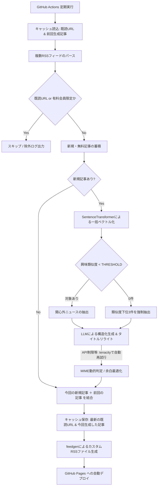

# rss-sentiment-arbitrage

指定したニュースメディアのRSSから、ユーザーの**関心領域外（フィルターバブル外）のニュース**を自動抽出し、Gemini APIを用いて大学生向けに構造化・平易化したカスタムRSSフィードを生成・配信するシステム。

## 1 システム概要

現代の情報収集におけるフィルターバブル（推薦アルゴリズムによる関心の偏り）を打破するための、逆フィルタリング型ニュース配信システム。

事前定義した関心テキストと各記事のコサイン類似度を計算し、類似度が低い（関心外である）記事のみを抽出。LLMを用いて、興味を惹かれるタイトルへのリライト、構造化された解説を自動生成し、GitHub Pages経由で新たなRSSフィード（XML）として配信する。

## 2. システムフロー

<strong>システムフロー図を見る（クリックで展開）</strong>

## 3. 主な機能

* キャッシュと履歴の二世代保持  
  actions/cache を利用し、処理済みURL（最大150件）と前回生成記事データをJSONで保存。重複処理を防ぎつつ、RSSには「今回＋前回」の二世代分の記事を出力し、読み逃しを防止。

* 記事抽出の効率化  
  SentenceTransformer (multilingual-e5-small) により全記事を一括ベクトル化。設定閾値以下の「関心外」ニュースのみを効率的に抽出。

* フォールバック抽出  
  閾値未満の記事が0件の場合は、類似度が低い下位3件を強制抽出してフィード出力を保証。

* AIによるタイトル・本文最適化  
  LLM で30文字以内の魅力的なタイトルにリライト。本文は「概要」「背景・要因」「社会・読者への影響」の3項目に構造化し解説。

* 堅牢なエラーハンドリング  
  tenacity を用いた指数的バックオフをLLM生成に実装。429エラーにも最大5回まで自動再試行。

* 運用監視ログの強化  
  有料記事除外の理由や処理件数を詳細に構造化してログ出力。

* RSS表示の最適化  
  記事概要に元ソース名と類似度スコアを明記。概要なしによる表示崩れ防止や、enclosure対応での画像埋め込みを最適化。

## 4. テクニカルスタック

* 言語: Python 3.10
* LLM SDK: google-genai (最新仕様)
* 生成モデル: gemini-3.1-flash-lite
* 埋め込みモデル: sentence-transformers (intfloat/multilingual-e5-small)
* リトライ制御: tenacity
* RSS生成: feedgen
* インフラ: GitHub Actions (CI/CD), GitHub Pages (ホスティング)

## 5. リポジトリ構成

* main.py: RSS取得、一括ベクトル化、LLM生成、XML出力までの全パイプラインを管理するメインスクリプト
* requirements.txt: 2026年現在の最新安定版パッケージ定義
* .github/workflows/generate-rss.yml: 毎日指定時刻に動作する実行定義ファイル

## 6. セットアップ手順

### 1. リポジトリの準備

本リポジトリを自身のGitHubアカウントにクローン、またはフォークして作成する。

### 2. 各種APIキー・トークンの取得

* Google AI Studio から Gemini API キーを取得。
* Hugging Face から Access Token (Read権限) を取得。

### 3. GitHub Secrets の設定

GitHubリポジトリの Settings > Secrets and variables > Actions に、以下の環境変数を正確に登録する。

* API_KEY1: 取得したGemini APIキー
* HF_TOKEN1: 取得したHugging Faceトークン

### 4. GitHub Pages の有効化

GitHubリポジトリの Settings > Pages にて、Build and deployment の Source を「GitHub Actions」に設定する。

### 5. ソースコードのカスタマイズ

main.py 内の以下の定数を、自身の情報収集目的に応じて変更する。

* SOURCE_RSS_URLS: 取得対象とするニュースメディアのRSS URLリスト
* INTEREST_TEXT: 自身の現在の興味（これと離れた記事が抽出される）
* THRESHOLD: 類似度の閾値（デフォルト: 0.821）
* EXCLUDE_KEYWORDS: 有料記事などを弾くための除外キーワード群

## 7. 利用方法

GitHub Actionsの実行が正常に完了すると、GitHub Pages環境へ自動デプロイされる。
生成された以下のURLを、FeedlyやNetNewsWireなどの任意のRSSリーダーアプリに登録して購読する。

https://[GitHubユーザー名].github.io/[リポジトリ名]/rss.xml

<<<<<<< HEAD
## 7. LICENSE
=======
## LICENSE
>>>>>>> ef6613df102318655ca437bc6af3eeec42d0a3f5

MIT
