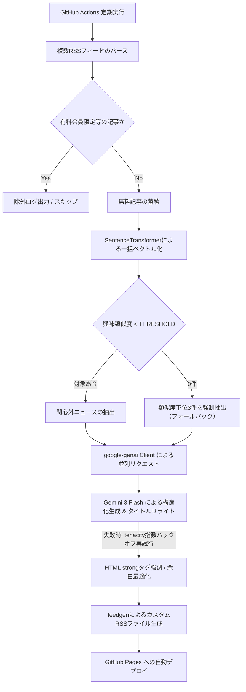

# rss-sentiment-arbitrage

指定したニュースメディアのRSSから、ユーザーの関心領域外（フィルターバブル外）のニュースを自動抽出し、Gemini APIを用いて大学生向けに構造化・平易化したカスタムRSSフィードを生成・配信するシステム。

## 1. システム概要

現代の情報収集におけるフィルターバブル（推薦アルゴリズムによる関心の偏り）を打破するための、逆フィルタリング型ニュース配信システム。
事前定義した関心テキストと各記事のコサイン類似度を計算し、類似度が低い（関心外である）記事のみを抽出。最新のLLMを用いて、インパクトのあるタイトルへのリライト、および構造化された詳細な解説（概要、背景・要因、社会・読者への影響）を自動生成し、GitHub Pages経由で新たなRSSフィード（XML）として配信する。

## 2. システムフロー

## 3. 主な機能

* バッチベクトル化と逆フィルタリング: SentenceTransformer (multilingual-e5-small) を用い、蓄積した全記事のベクトル計算を一括実行。設定した閾値以下の「関心外」ニュースのみを高効率に抽出。
* フォールバック抽出: 閾値未満の記事が0件の場合、相対的に類似度が低い下位3件を強制抽出し、フィードの出力を保証。
* AIタイトルリライト & 構造化平易化: gemini-3-flash を用い、大学生の興味を惹く30文字以内のタイトルへ刷新。本文を「概要」「背景・要因」「社会・読者への影響」の3項目に構造化し、400〜600文字で深掘り解説。
* 堅牢なエラーハンドリング: tenacity による指数的バックオフをLLM生成部に実装。APIのレートリミット（429エラー）発生時も最大5回まで自動再試行。
* 運用監視ログの強化: 有料記事の除外理由（ヒットしたキーワード）やフィードごとの処理件数を詳細に構造化ログ出力。
* RSS表示の最適化: 各記事の概要欄（description）に元のソースサイト名と類似度スコアを明記。「概要なし」によるリーダー側の表示崩れを防止し、インラインCSSによる余白調整、画像の埋め込み（enclosure対応）を最適化。

## 4. テクニカルスタック

* 言語: Python 3.10
* LLM SDK: google-genai (最新仕様)
* 生成モデル: gemini-3-flash
* 埋め込みモデル: sentence-transformers (intfloat/multilingual-e5-small)
* リトライ制御: tenacity
* RSS生成: feedgen
* インフラ: GitHub Actions (CI/CD), GitHub Pages (ホスティング)

## 5. リポジトリ構成

* main.py: RSS取得、一括ベクトル化、LLM生成、XML出力までの全パイプラインを管理するメインスクリプト
* requirements.txt: 2026年現在の最新安定版パッケージ定義
* .github/workflows/generate-rss.yml: 毎日指定時刻（日本時間 6:00, 12:00, 19:00）に動作する実行定義ファイル

## 6. セットアップ手順

### 1. リポジトリの準備

本リポジトリを自身のGitHubアカウントにクローン、またはフォークして作成する。

### 2. 各種APIキー・トークンの取得

* Google AI Studio から Gemini API キーを取得。
* Hugging Face から Access Token (Read権限) を取得。

### 3. GitHub Secrets の設定

GitHubリポジトリの Settings > Secrets and variables > Actions に、以下の環境変数を正確に登録する。

* API_KEY1: 取得したGemini APIキー
* HF_TOKEN1: 取得したHugging Faceトークン

### 4. GitHub Pages の有効化

GitHubリポジトリの Settings > Pages にて、Build and deployment の Source を「GitHub Actions」に設定する。

### 5. ソースコードのカスタマイズ

main.py 内の以下の定数を、自身の情報収集目的に応じて変更する。

* SOURCE_RSS_URLS: 取得対象とするニュースメディアのRSS URLリスト
* EXCLUDE_KEYWORDS: 有料記事などを弾くための除外キーワード群
* INTEREST_TEXT: 自身の現在の興味（これと離れた記事が抽出される）
* THRESHOLD: 類似度の閾値（デフォルト: 0.821）

## 7. 利用方法

GitHub Actionsの実行が正常に完了すると、GitHub Pages環境へ自動デプロイされる。
生成された以下のURLを、FeedlyやNetNewsWireなどの任意のRSSリーダーアプリに登録して購読する。

https://[GitHubユーザー名].github.io/[リポジトリ名]/rss.xml